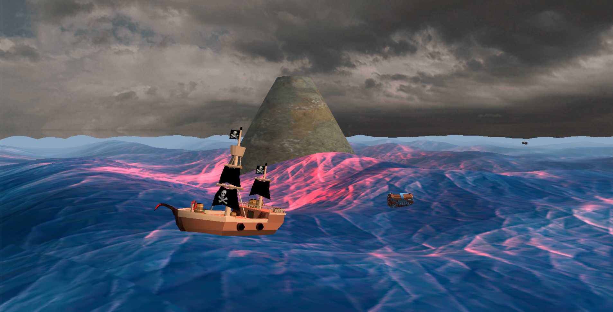
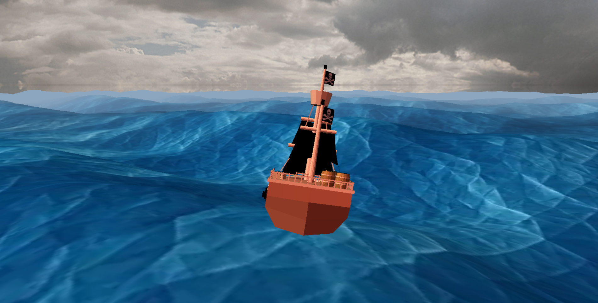
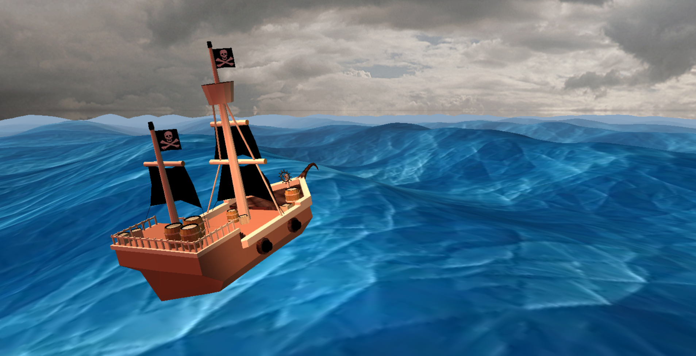
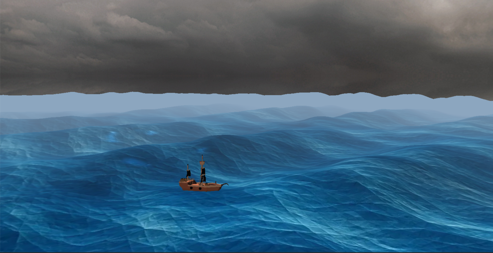

# Pirate Ship — OpenGL

Semester project from FIT CTU Prague — BI-PGR (Computer Graphics).

A real-time 3D scene of a pirate ship on an animated ocean, built with OpenGL and C++.

## Features

### Ocean simulation
- Gerstner wave algorithm implemented in both the vertex shader (GPU) and CPU
- Multiple wave components summed together to produce an irregular, realistic ocean surface
- The CPU implementation mirrors the shader math exactly — used for ship physics

### Ship physics
- Ship height tracks the wave surface in real time (vertical lerp toward wave displacement)
- Ship tilt is computed by sampling wave normals at four hull probe points and averaging them
- Smooth tilt response via interpolation — no instant snapping

### Scene objects
- Pirate ship (glTF model with textures)
- Treasure chest (OBJ with diffuse and normal maps)
- Seagull (OBJ, animated flight path)
- Volcano island
- Billboard clouds with transparency
- Cubemap skybox (6-sided gray cloud texture)

### Rendering
- Per-object GLSL shader programs: water, standard objects, chest (with normal mapping), skybox, clouds
- Normal mapping on the treasure chest
- Depth testing, double buffering, free camera with mouse look

## Tech stack

OpenGL 3.3, GLUT, PGR framework (FIT CTU), GLM, C++

## Building

Open `shaders-simple.sln` in Visual Studio. Requires the PGR framework headers and libs from the course.
